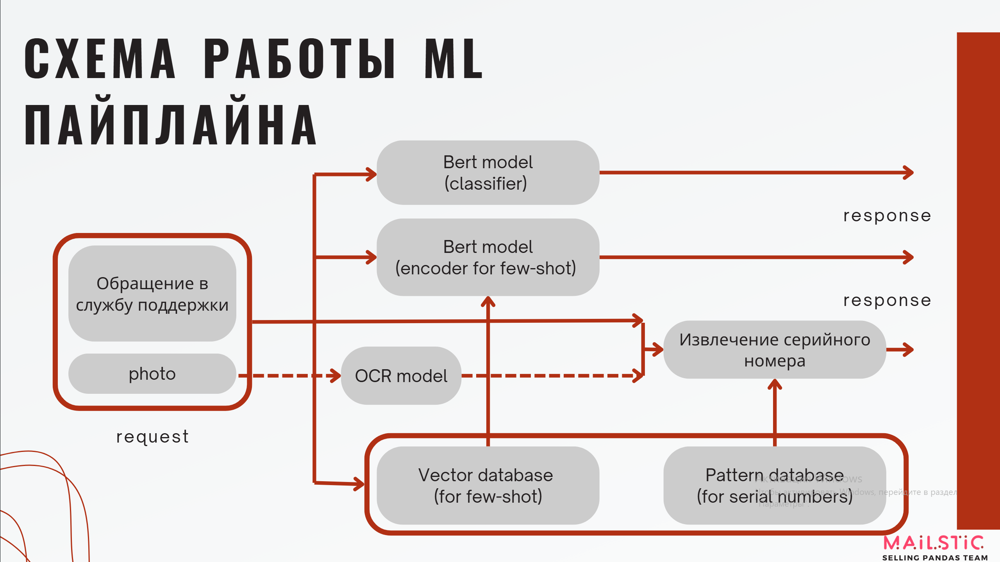
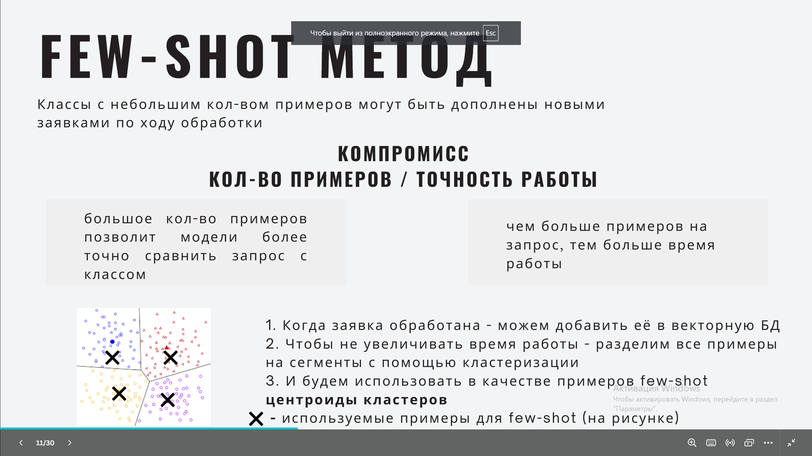
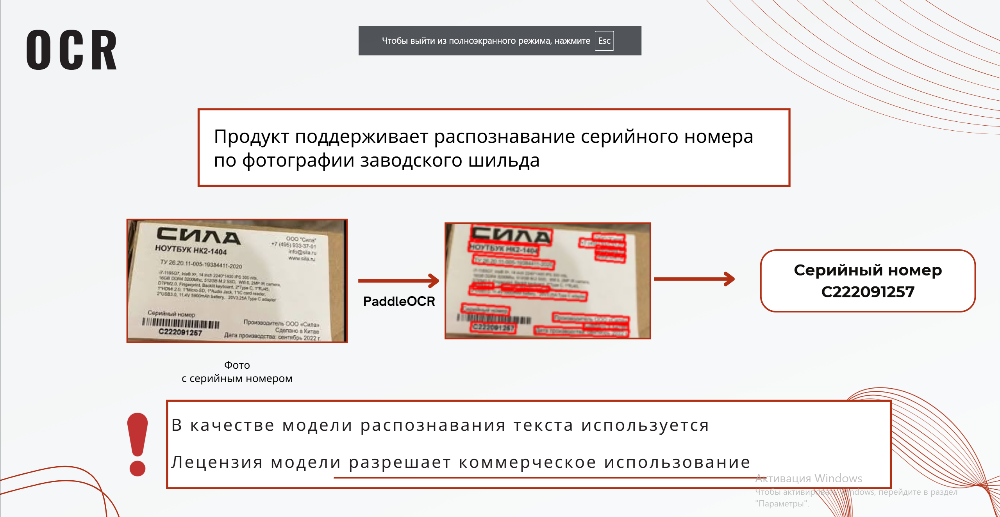

## MAILSTIC
### Сервис для автоматической диспетчеризация заявок

О сервисе

**MAILSTICK** - система для автоматизации диспетчезирации заявок на поломку технического оборудования. Система не только предсказывает тип оборудования и точку его отказа по переписке, а также извлекает серийный номер, но и поддерживает добавление новых видов точек отказа, способна распознавать серийный номер по фотографии, давать рекомендации и советы на основе вопроса пользователя.

## Основная информация

**Приложение развернуто** на домене **[здесь](https://90.156.208.6:8501)**.

**Скринкаст**  [cсылка](TODO)

**Инструкция по запуску сервиса** описана в **[quick-start.md](quick-start.md)**.

Дополнительная **техническая информация** к модулям платформы расположена в **[docs](https://docs.google.com/document/d/1D1EEkDeCVxrsu3YZO1000eUsfilrrg-bNn6C-GX80IU/edit?tab=t.0)**.

Документация API в формате **[OpenAPI 3](https://90.156.208.6:8000/docs)**

## Оглавление
- [ML-решение. Основной пайплайн](#ml-решение-основной-пайплайн)
- [ML-решение - модель](#ml-решение---модель)
- [ML-решение - few-shot learning](#ml-решение---few-shot-learning)
- [API](#api)
- [Дополнительный функционал](#дополнительный-функционал)
  - [OCR](#ocr)
  - [Добавление новых точек отказа](#добавление-новых-точек-отказа)
  - [Гибкая настройка регулярных выражений](#гибкая-настройка-регулярных-выражений)
- [Интерфейс](#интерфейс)

## ML-решение. Основной пайплайн

В нашем решении реализовано несколько способов определения точки отказа. 
Первый - обученная модель архитектуры Bert на зафиксированном набооре классов. Этот варинт показывает 
высокую точность но сложен в масштабировании. 

Поэтому нами был реализован способ few-shot предсказание точки отказа.
Для этого была дообучена та же модель, но уже с использованием triplet loss-а для 
получения репрезентативных представлений в векторном пространстве. Этот метод позволяет 
написать всего несколько примеров обращений по новой точке отказа и этот класс уже 
будет доступен для распознавания в нашем сервисе. 

## ML-решение - модель
В качестве основной модели использовалась модель архитектуры Bert
LaBSE (Language-agnostic BERT sentence embedding model)
В частности - форк модели, словарь которой содержит только русские и английские токены (LaBSE for English and Russian).
Лицензия модели позволяет коммерческое использование. 
Ключевой особенностью LaBSE является её способность создавать высококачественные, масштабируемые эмбеддинги.
Исходная модель была обучена с использованием енкодеров больших языковых моделей.

[Language-agnostic BERT Sentence Embedding Fangxiaoyu Feng∗
, Yinfei Yang∗† , Daniel Cer, Naveen Arivazhagan, Wei Wang](https://arxiv.org/pdf/2007.01852)

## ML-решение - few-shot learning

Для этого внутри мы поддерживаем векторную базу данных с набором представлений уже обработанных заявок.

Кроме того, эта база может пополняться уже отработанными заявками, за счёт чего количество и 
разнообразие данных различных классов будет повышаться.

Отдельное значение имеет алгориитм, по-которому мы выбираем примеры, которые будут
использоваться в качестве few-shot примеров:
1. Все сэмплы кластеризуются в векторном пространстве;
2. Из каждого кластера берется сэмпл, наиболее близкий к центру кластеров

Так соблюдается баланс между разнообразием и аномальностью выбранных данных.
Приведенный алгоритм иллюстрирует схема:

## API
Мы разработали API, которое поддерживает весь функционал сервиса и может быть 
быстро внедрено в внутренний контур компании. Ссылка и дкоументация расположена в верхней части страницы.

## Дополнительный функционал
### OCR
Также мы поддерживаем распознавание серийного номера прямо с фотографии пользователя, что 
может улучшить пользовательский опыт взаимодействия с службой поддержки. 
Теническая реализация использует как основную модель PaddleOCR. Далее данные полученные
с изображения отправляются в тот же пайплайн что и обычный текст письма.

### Добавлениие новых точек отказа
Особенности технической реализации описаны выше, с точки зрения использования эта функция 
позволяет добавлять новые точки отказа, загрузив всего несколько примеров и итеративно
улучшать качество предсказания, использую отработанные заявки. 
Это позволяет быстро расширять сервис технической поддержки на новые продкуты, и, как следствие,
новые точки отказа.

### Гибкая настройка регулярных выражений
Мы разработали собственный формат выражений для поиска серийных номеров и парсер для него.
Это позволяет пользователю буквально за несколько минут разобраться с требуемым форматом 
и добавить или изменить правило поиска  ерийных номеров, если, например, оно изменилос.

## Интерфейс
Для разработки интерфейса использовался фреймворк Streamlit. 
В интерфейсе поддерживаются все функции, предоставляемые сервисом, но в визуально 
понятном и удобном формате. Исполььзя его можно настраивать правила обработки и они 
будут сразу же применены к приходящим в API запросам.

